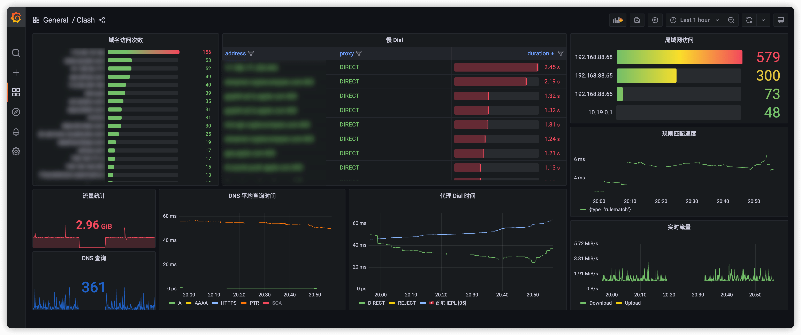

# Clash Tracing Dashboard

An example of a clash tracing exporter API.

### Screenshot

### How to use

1. modify `docker-compose.yaml` and start (`docker-compose up -d`)
2. setup Grafana (add datasource)
3. import `panels/dashboard.json` and `panels/logs.json` to Grafana

#### 注：本项目完全搬运自D大的clash-tracing
参考部署文章：
  https://always200.com/clash-tracing-windows/
  https://hexo.xadocker.cn/2022/06/26/16742.html
